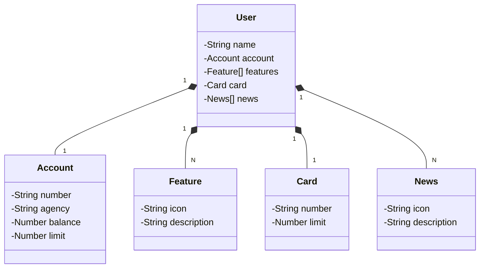

# santander-dev-week-2023-java
Java RESTFul API criada para Santander dev week 2023
## Diagrama de classes

```mermaid
classDiagram
  class User {
    -String name
    -Account account
    -Feature[] features
    -Card card
    -News[] news
  }

  class Account {
    -String number
    -String agency
    -Number balance
    -Number limit
  }

  class Feature {
    -String icon
    -String description
  }

  class Card {
    -String number
    -Number limit
  }

  class News {
    -String icon
    -String description
  }

  User "1" *-- "1" Account
  User "1" *-- "N" Feature
  User "1" *-- "1" Card
  User "1" *-- "N" News
```

### Tecnologias utilizadas:

  
  

